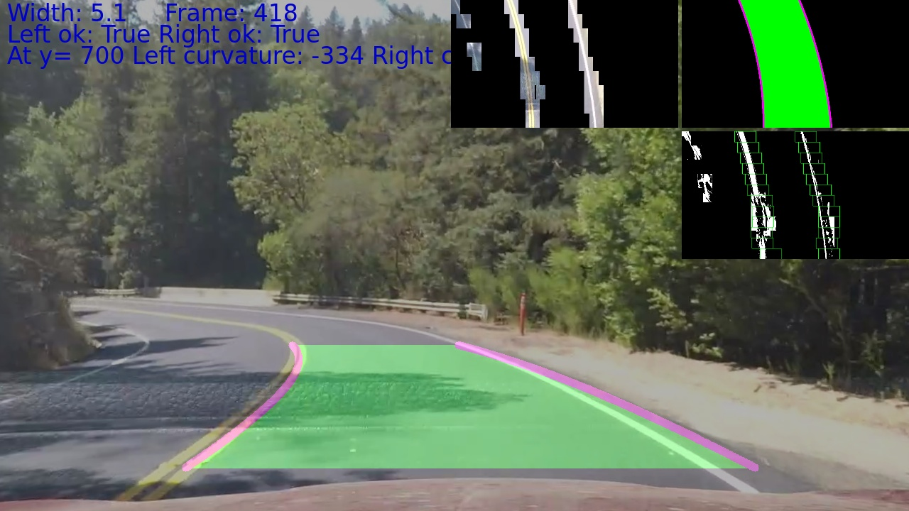

**Advanced Lane Finding Project**

The goals / steps of this project are the following:

* Compute the camera calibration matrix and distortion coefficients given a set of chessboard images.
* Apply a distortion correction to raw images.
* Use color transforms, gradients, etc., to create a thresholded binary image.
* Apply a perspective transform to rectify binary image ("birds-eye view").
* Detect lane pixels and fit to find the lane boundary.
* Determine the curvature of the lane and vehicle position with respect to center.
* Warp the detected lane boundaries back onto the original image.
* Output visual display of the lane boundaries and numerical estimation of lane curvature and vehicle position.

[//]: # (Image References)

[image1]: ./output_images/undistorted.png "Undistorted"
[image2]: ./test_images/test1.jpg "Road untransformed"
[image3]: ./output_images/undistorted-jpg.jpg "Road Transformed"
[image4]: ./output_images/perspCalImage.jpg "Rectangle"
[image5]: ./output_images/perspTransformed.jpg "Top view"
[image6]: ./output_images/persRestored.jpg "Inverse"
[image7]: ./result.png
[video1]: ./project_video.mp4 "Video"
[image8]: ./SegmentDistance.png "SegmentDistance"

## [Rubric](https://review.udacity.com/#!/rubrics/571/view) Points

### Here I will consider the rubric points individually and describe how I addressed each point in my implementation.  

### Camera Calibration

#### 1. Briefly state how you computed the camera matrix and distortion coefficients. Provide an example of a distortion corrected calibration image.

The code for this step is contained in the first code cell of the IPython notebook located in "mqAdvancedLanes.ipynb" steps 1 to 9.  

I start by preparing "object points", which will be the (x, y, z) coordinates of the chessboard corners in the world. Here I am assuming the chessboard is fixed on the (x, y) plane at z=0, such that the object points are the same for each calibration image.  Thus, `objp` is just a replicated array of coordinates, and `objpoints` will be appended with a copy of it every time I successfully detect all chessboard corners in a test image.  `imgpoints` will be appended with the (x, y) pixel position of each of the corners in the image plane with each successful chessboard detection.  

I then used the output `objpoints` and `imgpoints` to compute the camera calibration and distortion coefficients using the `cv2.calibrateCamera()` function.  I applied this distortion correction to the test image using the `cv2.undistort()` function and obtained this result:

![alt text][image1]

That applied to a real world image

![alt text][image2]
 produce this images:
![alt text][image3]

#### 2. Color transforms, gradients or other methods to create a thresholded binary image.  

From the first project I lern a lot so I start doing a HSV transforms and removing everithing but
I used a combination of color and gradient thresholds to generate a binary image (thresholding steps at lines # through # in `another_file.py`).  Here's an example of my output for this step.  (note: this is not actually from one of the test images)

You can see images in the mqAdvFindLines.ipynb Jupiter-notetebook and find photos there and in procVideo.py the functions:

`maskHSVYellowAndWhite
def doImageProcess(image):
def procSobel(img,thresh_min = 20,thresh_max = 100):`

That makes the color filters and also sobel filters.

That kind of filters are far to be good in the harder challenge or on hi contrast images I have failures, so I decide to train a nural network in order to detect and filter the lines in the images.

#### 3. Perspective transform.

To do measurements in the car images we will preform a perspective transform, suposing a plat plane ground, thats is not true and there are some points where it can be detectec, for example in the bridge, the car bounces and it can be detected in the changing length or the lane.

First I check where is the photo taken and I found it!!!! that it is [here](https://www.google.es/maps/@37.4398602,-122.2485646,3a,75y,321.74h,82.59t/data=!3m6!1e1!3m4!1sDkPzleAWMIFzyiAlx8VPzw!2e0!7i13312!8i6656?hl=en)

So I can measure the distance between lines with the help of satellite view in Google
maps

![satelite measurement][image8]

I calculate around  14.5 between segments and a width of 14m 4 lanes, so 1 lane 3.5m

Thats a good reference to calibrate the perspective transform.

Over a undistorted image we fill get the original points and select the destination points
so we made a rectangle of 3.5m/29m H/W

|Source|Destination|
|:----:|:---:|
|300,660|300,700|
|110,660|1010,700|
|700,460|1010,20|
|586,460|300,20|

So we can get the transformation matrix with `M=getTransform(org,dst)`

and it inverse as

`Minv=getTransform(dst,org)`

as a result we can view three images Original with the known rectangle, the perspective transformation and finally the inverse

![rectangle][image4]
![top][image5]
![perspective][image6]

The Inverse transformation is very slow, To draw the result lines and oder re-projections I'm using the function: `cv2.perspectiveTransform` hundreds times faster.

#### 4. Identifying lanes and fiting with 2nd order polynomial.

I'm using a modified version of sliding window to get the lines, it have memory to know were to start in following frames even supoising where the lane segments will be.

The funcion `curveStepOne`

I also added a maximum number of dots in a window in order to discard it to avoid saturated areas.

Ones I have selectec the right and the left windows with the dots that conform the lines I apply the numpy function `polyfit` that you can find in function `curveStepOne`

I have done several test to discard lines, basically I'm doing this tests:

1) Require a minimum number of windows to validate the lines.
2) check it the lanes are reasonably parallel, to achieve it I calculate the mean, maximum and minimum distance between part of the curve. It is important to calculate
the parallel point of the line because in a curve it is not the ones ho have the same Y coordinate.
3) No sharp angles in the road, I invalidate lines with small radius.

There are four important functions in procVideo.py
checkParallel  -> verify if two fits are reasonably parallel
gen_parallel  -> with one line generate a parallel one (not just an offset)
curvatureLine -> check the curvature for a full line
curvature -> a in the lectures proposed function with little modifications.

#### 5. Describe how (and identify where in your code) you calculated the radius of curvature of the lane and the position of the vehicle with respect to center.

The curvature is done using funtions curvatureLine and curvature as proposed in the lectures, the first one is for only one fit.

I also find and interesting post in stackoverflow about how to [calculate the curvature](https://stackoverflow.com/questions/28269379/curve-curvature-in-numpy)

#### 6. There is a example of output of my procVideo.py program.

![output][image7]

There you can see some ODS information like the radius.

Also you can see two additional images, with the calculated lane in top view and the windows used to calculate the lanes, in red the bad windows and in green the good ones.

Also you can see that the right line is discard and my calculated parallel is in its place, you can know by the second line if there is a discarded line.

---

### Pipeline (video)

#### 1. Result videos.

Here's a [link to my video result](./out_project_video.mp4)

You can see a green area when everithing is ok, yellow when one of two lines of the lane is wrong in that case I do the lane with a parallel line to the good one, and  finally a red if I can't detect the lane.

---

### Discussion

#### 1. It is not robust

The system is robust in the project video and in the challenge (except first frames) but in the harder challenge is a mesh.

So I've decided to do a new version, using a neural network to filter areas of 50wx80h that are lines or not.

The result is very good, but with a bad performance, with more time it could be refined but it is a very good start.

In this screenshot you can see In right small image the filter generated by the neural network, it works in the topview space.

Here is the full video, it is not perfect but woks very well.

[harder_challenge_video_](./harder_challenge_video.mp4)

The training of the network is in modelW.py and the trained model is in model.h5.

Im my model I only train lines or not, but I think that I can go further and train right, middle and left lines and do a robust network.

It fails in the sharper curves and in the dark scene with cars.

Any way I wouldn't put my live in his hands :)
